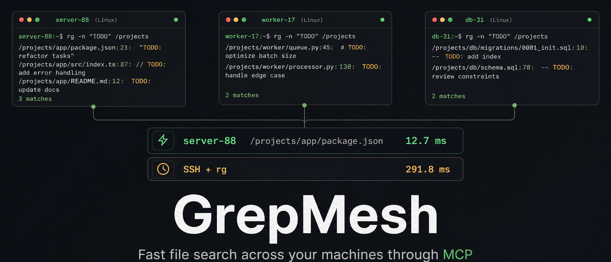

# GrepMesh



> Search and read files across your machines through one fast local MCP.

Coding agents waste time opening SSH sessions and rescanning broad filesystems.
GrepMesh runs next to each agent, delegates exact searches directly to the
selected host, and returns bounded results with truthful partial-host status.

In a real three-host deployment, a remote exact-file search completed in
12.7 ms median versus 291.8 ms through SSH plus `rg` (25/25 correct runs), while
the GrepMesh service used roughly 6-8 MB of memory per host.

## What it does

- `search_text` searches literal, case-insensitive, or regex text across hosts.
- `find_paths` locates files by glob or substring.
- `read_text` reads a bounded line range from a selected host.
- `search_status` reports backend, topology, and per-host status.
- Direct peer fan-out avoids a central search bottleneck.
- MCP `initialize.instructions` tells agents to use GrepMesh before shell scans.

## Install

```bash
git clone https://github.com/meanwebuser/grepmesh.git && cd grepmesh && ./install.sh
```

Requirements: Linux, Rust/Cargo, and [ripgrep](https://github.com/BurntSushi/ripgrep).

Edit `~/.config/grepmesh/config.json`, then start the server:

```bash
~/.local/bin/grepmesh-mcp --config ~/.config/grepmesh/config.json
```

## Connect an agent

OpenCode:

```json
{
  "mcp": {
    "grepmesh": {
      "type": "remote",
      "url": "http://127.0.0.1:9419/mcp",
      "enabled": true
    }
  }
}
```

Codex:

```toml
[mcp_servers.grepmesh]
url = "http://127.0.0.1:9419/mcp"
enabled = true
```

Hermes:

```bash
hermes mcp add grepmesh --url http://127.0.0.1:9419/mcp
```

The included `deploy/install_clients.py` updates existing OpenCode, Codex, and
Hermes user configs and adds the global search-routing instruction. It creates
timestamped backups before changing a file.

## Build a mesh

Give each node a unique `host_id`, expose its management/VPN address, and list
the other nodes under `peers`. Non-loopback listeners require a shared bearer
token through `peer_auth_token_env`. Keep the service private to a management
network; do not expose it directly to the public Internet.

Use narrow named roots for frequently searched projects. Searching a project
root is faster and more predictable than traversing an entire `/home` or `/opt`.

## Verify

```bash
cargo test --all-targets
cargo clippy --all-targets -- -D warnings
```

License: [MIT](LICENSE).
